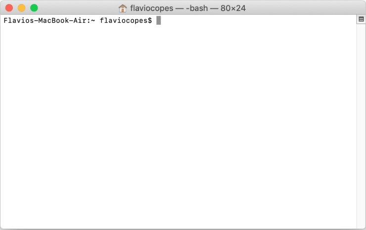
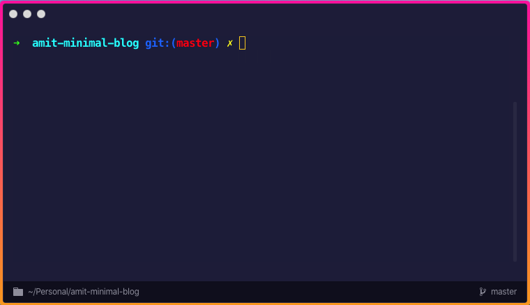

Your normal bash might have functions you normally need, but if you are a regular terminal user, zsh will be changing the way you type commands.

Features that zsh, ohmyzsh and hyper together provide will simply blow your mind.

>Did you know you can control Spotify from your terminal? Yes, Hyper Plugins allow you to do that.

Setting up this stuff can be overwhelming for a beginner, so here's a very simple guide to get started! 🤩

### 🔥 Introduction

If you are using a regular terminal like what you see below, you are missing a lot of features that OhMyZsh provides.


Today, you'll be doing a terminal makeover to make it look like this...



Not just the looks, but OhMyZsh comes with ample of features to lighten up your programming journey.

At the end of the tutorial, this is what you would be able to do in your terminal...

- NPM, Git autocomplete
- Auto Suggestions while you type in the terminal
- Syntax Highlighting that tells if a command is defined
- Use the cursor to edit the terminal command
- See `git branch` and `git status` of the current directory
- Open new tabs with the same directory as the current tab
- Use OhMyZsh features like navigating without using `cd`, usage of `ll`, easier tab-click based navigation, and much more!

### ❤️ Get Started

First, you have to install `zsh`. In some cases (depends on the OS you are running), it would already be installed. Therefore, check if it's installed by running `zsh --version` in your terminal.

The installation process for `zsh` is different in different Operating Systems. Checkout the [Zsh Installation Guide](https://github.com/ohmyzsh/ohmyzsh/wiki/Installing-ZSH) to install zsh.

After you install Zsh, make sure you make it your default shell. Run the following in your terminal to do so.

```bash
sudo chsh -s $(which zsh)
```

Log out and Log in back to your default shell. Run `echo $SHELL` and the output `/bin/zsh` or similar is expected.

### 🔰 Installing OhMyZsh

> Note that zsh and OhMyZsh are different.

Install `OhMyZsh` by running the following command in terminal.

```bash
sudo sh -c "$(curl -fsSL https://raw.githubusercontent.com/robbyrussell/oh-my-zsh/master/tools/install.sh)"
```

When you install OhMyZsh, many plugins come with it for your rescue!

To add useful plugins, Open `~/.zshrc` in TextEdit/Notepad/Vim/VSCode.

In the list of plugins that you see in the file, just add a plugin named `npm`, like this 👇

```bash
plugins=(
  git
  bundler
  dotenv
  osx
  rake
  rbenv
  ruby
  npm # you added this
)
```

Voila! You are done with OhMyZsh! To see the changes, run source `~/.zshrc` in the terminal, and now you have the features of an OhMyZsh shell.

### 🔰 Installing HyperTerm by Zeit

Zeit (the creator of now.sh and Next.js) has created an awesome terminal app for us that is built in Electron.

Download Hyper from [here.](https://hyper.is/)

### ⚛️ Configure Hyper with OhMyZsh

Open Hyper Terminal. You won't see OhMyZsh running there. So, go to Hyper Settings. On OSX, it's `Hyper > Preferences`.

That would open a `.hyper.js` file in your favorite editor. This file contains all the settings of your terminal that are super easy to control!

To enable OhMyZsh as a default shell in Hyper, make this change in `.hyper.js` 👇

```bash
- shell: '/bin/bash'
+ shell: '/bin/zsh'
```

__And that would make OhMyZsh your default Hyper Terminal shell!__

#### 🤩 Autocomplete while you type a command

Git Clone the `zsh-autocomplete` plugin in the OhMyZsh plugin folder.
```bash
sudo git clone https://github.com/zsh-users/zsh-autosuggestions ${ZSH_CUSTOM:-~/.oh-my-zsh/custom}/plugins/zsh-autosuggestions
```

Once that is done, add the plugin in the `~/.zshrc` file's plugin list.
```bash
plugins=(
  ...
  zsh-autosuggestions
)
```

#### 🎉 Zsh sytax highlighting

Git Clone the `zsh-syntax-highlighting` plugin in the OhMyZsh plugin folder.
```bash
sudo git clone https://github.com/zsh-users/zsh-syntax-highlighting.git ${ZSH_CUSTOM:-~/.oh-my-zsh/custom}/plugins/zsh-syntax-highlighting
```

And once again add it in the plugins list of the `.zshrc` file.
```bash
plugins=(
  ... 
  zsh-syntax-highlighting
)
```

>Note: To reflect every change you make, do source `~/.zshrc` in the terminal.

#### 📯 Enabling Hyper related features and themes

Open `.hyper.js` by toggling Settings of Hyper Terminal.

Check out the plugins: [...] section and paste these plugin names there.
```bash
plugins: [
  ...
  'hypercwd',
  'hyper-statusline',
  'hyper-alt-click',
  'hyperterm-safepaste',
  'hyper-search',
  'hypergoogle',
  'hyperborder',
  'hyper-tab-icons',
  'hyper-hide-title',
  'shades-of-purple-hyper'
],
```

Save the file and Hyper would automatically install those plugins and themes for you. To reflect the changes, just close and start Hyper Terminal again.

Hooray! __You now have all the features in your terminal.__

##### BONUS: Setting up the same terminal configuration for Integrated Terminal in VSCode

In the VSCode Settings, add the following JSON key-value pairs and you'll be good to go!
```json
{
  ...
  "terminal.integrated.shell.osx": "/bin/zsh",
  "terminal.integrated.fontSize": 16
}
```

__And that is it folks!__

### 🔥 Resources

- <https://ohmyz.sh>

- <https://hyper.is>

### 🏆 About me

I am Kumar Amit, JavaScript React and NodeJS Developer who is focused on building scalable products to impact people.

[Connect with me on Twitter 🐦](https://twitter.com/amitrajofficial)